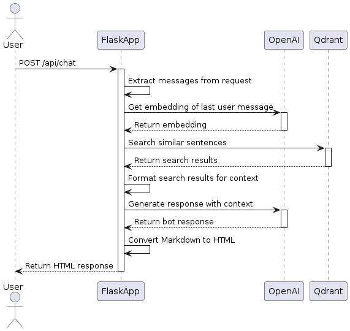

# Backend của ứng dụng Chat bot hỗ trợ dịch vụ Auction Help

Dự án này là một ứng dụng Flask phục vụ như một chat bot để hỗ trợ dịch vụ Auction Help. Nó sử dụng mô hình GPT của OpenAI và Qdrant để tìm kiếm các câu tương tự.



## Cài đặt

Đầu tiên, clone kho lưu trữ về máy cục bộ của bạn:

```sh
git clone https://github.com/yourusername/your-repo-name.git
```

Cài đặt các yêu cầu:

```sh
pip install -r requirements.txt
```

## Sử dụng

Để khởi động máy chủ, chạy:

```sh
python app.py
```

Máy chủ sẽ khởi động tại `http://0.0.0.0:8080`.

## Điểm cuối API

- `GET /`: Trả về trang chủ.
- `POST /api/chat`: Nhận một payload JSON với `query` và `context`, và trả về một phản hồi từ mô hình GPT.

Payload JSON gồm:

```json
{
  "messages": [
    {
      "role": "system",
      "content": "You are a helpful assistant."
    },
    {
      "role": "user",
      "content": "Who won the world series?"
    }
  ]
}
```

Phản hồi JSON gồm:

```json
{
  "role": "assistant",
  "content": "The Los Angeles Dodgers won the World Series in 2020."
}
```

## Biến môi trường

Ứng dụng sử dụng các biến môi trường sau, được lưu trữ trong một file `.env`:

```properties
OPENAI_API_KEY=your_openai_api_key
QDRANT_API_KEY=your_qdrant_api_key
```

## Đóng góp

Giải thích cách đóng góp vào dự án của bạn.

## Giấy phép

Bao gồm thông tin về giấy phép.